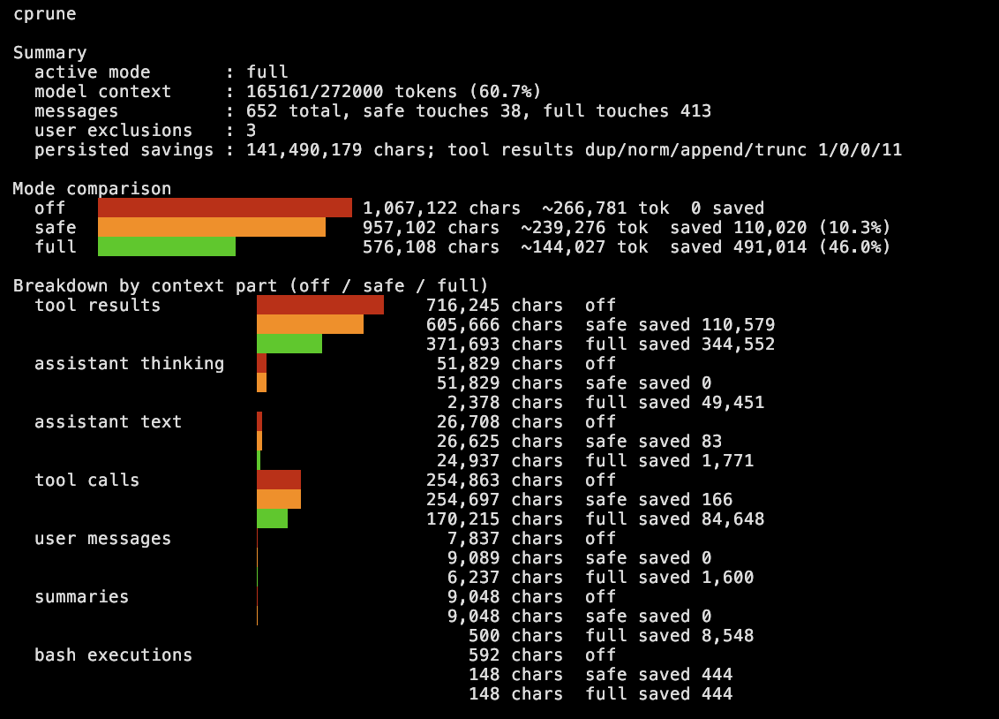

# cprune Pi extension

Context pruning extension for Pi. It reduces duplicate, append-only, stale, and oversized context before model calls. It can also request Pi's supported persistent compaction mechanism when you explicitly want a lossy summary.

Append/contained pruning detects exact byte prefixes, normalized line-prefixes, substantial normalized contained blocks, and repeated line chunks, so it can catch repeated output with new lines appended even when ANSI escapes, CRLF/LF, trailing whitespace, small wrappers, or some middle insertions differ. Older repeated read-only snapshot commands such as `rg`, `find`, `ls`, and `git status` are also pruned when the same command is run again later. Old custom extension messages are deduped/truncated generically, structured entity notifications are compacted when superseded, and boilerplate “run/show for full context” tails are stripped without hardcoding one extension.

Entity-aware pruning is generic rather than tied to one extension: it detects IDs like `TASK-123`, `SPEC-12`, `DISC-3`, `ISSUE-9`, `PR-42`, etc., then applies a latest-entity-snapshot-wins policy across older user messages, custom extension messages, tool results, assistant text, and summaries while preserving IDs, hashes, and short previews. Old successful assistant tool calls can be compacted to tool name, IDs/paths, hash, and preview, so large prior spec/comment bodies do not remain in request context. Non-core tool results with the same tool+entity are also superseded by newer successful results.

## Highlights

- Three operating modes: **off**, **safe**, and **full**.
- `/cprune` shows a compact off/safe/full comparison with red/orange/green bars, plus a cache-impact section that predicts per-mode prompt-cache hit rate vs the previous turn **without extra LLM calls**.
- Conservative persist-time pruning handles exact/normalized duplicates, append repeats, and oversized tool results, while preserving failed diagnostics, mutation outputs, side-effectful shell commands, and non-repeatable browser/API-style results.
- Prompt-time pruning removes stale, duplicate, oversized, or explicitly user-excluded context before model calls.
- `/cprune review` and `/cprune review-prompts` let users explicitly exclude large entries or prompt/response turns without rewriting Pi history.
- `/cprune compact` appends a supported Pi compaction entry using a deterministic cprune summary, avoiding model `context_length_exceeded` failures on very large sessions.

## Screenshot



## Cache impact

Prompt caching makes long context cheap when consecutive turns share a stable prefix. Pruning that changes an older message retroactively breaks that prefix, turning cheap cached reads into expensive misses. cprune's `/cprune` comparison now shows this tradeoff explicitly:

- **Predicted cache hit** per mode (off/safe/full) computed offline with a **provider-aware** model. Because providers cache differently, cprune detects the cache model from the response (`api`/`provider`) and headlines the matching one: strict-prefix for OpenAI/gpt/Anthropic (a retroactive change invalidates the cached tail), content/block-reuse for zai/glm gateways. No extra model calls are made.
- **Estimated cost savings** derived from real per-token billing (`usage.cost.input / input`, with a blended fallback). When a provider reports no cost, cprune falls back to assumed model pricing (configurable via `modelInputPricePerMTok` / `fallbackInputPricePerMTok`) and labels it `(assumed pricing)`. Under the cache-aware prefix-freeze, pruned tokens are uncached new-tail tokens, so pricing them at the input rate is a fair estimate of money saved.
- Cumulative session cost savings persisted across turns.
- A recommendation appears when `full` mode costs ≥1.3× of `off` on a prefix-sensitive provider.
- **Relative cost index** using provider economics (cached reads ≈ 0.1×, misses/cache-writes ≈ 1.25×), so you can see when `full` mode's token savings are outweighed by cache penalties.
- **Actual cache stats** read from the live response (`cacheRead`, `cacheWrite`, `input`, `cost`) to validate the prediction.

This makes the cost/benefit of each mode visible in real sessions rather than only theoretical.

## Cache preservation

A known risk with any context pruner: retroactively changing an already-sent message can invalidate the prompt cache. cprune is designed to avoid that penalty rather than cause it.

- On **prefix-sensitive providers** (OpenAI/gpt, Anthropic), full mode **freezes the committed prefix** — once a message's pruned form is sent, that form is locked, so the cache prefix never breaks and only the new tail misses.
- On **content-cache providers** (e.g. zai/glm gateways), which re-serve unchanged blocks after a change, full mode stays fully aggressive since retroactive changes carry no cache penalty there.

`/cprune` reports both a provider-aware *predicted* cache hit (computed offline, no extra LLM calls) and the *actual* `cacheRead` from the live response, along with estimated cost savings, so the tradeoff is visible in real sessions rather than only theoretical.

## Safety and information loss

cprune has two pruning points:

- **Persist-time pruning** runs on new tool results before Pi stores them. This is intentionally conservative and limited to mechanical cases: exact duplicates, normalized duplicates where only ANSI/CRLF/trailing whitespace differ, append/prefix repeats, and oversized tool results with hash/original-size metadata plus retained head/tail preview.
- **Prompt-time pruning** runs before a model request. It is non-destructive to Pi's active session files, but can be more aggressive because it only changes the context sent to the model for that request. `/cprune review` adds explicit user-approved prompt-time exclusions for large older entries; `/cprune review-prompts [safe|full] [N] [page]` lets you exclude a selected prompt/response turn from prompt history. These exclusions are persisted as cprune state, not by rewriting Pi history.

cprune should not be described as fully lossless. Persist-time pruning is near-lossless but still replaces bytes in saved tool results for the safe cases above. Prompt-time pruning may replace older details with hashes, IDs, previews, and re-run hints. This reduces token use, but the model may no longer see every historical byte in the immediate request.

cprune has three operating modes:

- **off**: no pruning is applied to future tool results or model prompts.
- **safe**: conservative mode. Persist-time pruning still handles mechanical duplicate/append/oversized tool results, and prompt-time pruning applies low-risk mechanical rules plus user-approved exclusions. It avoids semantic/latest-wins rules such as stale reads, entity snapshot pruning, old thinking removal, and historical tool-call argument compaction.
- **full**: aggressive/default legacy behavior. Includes safe rules plus semantic/latest-wins prompt-time pruning, stale reads, entity/tool-result supersession, old thinking removal, and tool-call argument compaction.

### Cache-aware full mode

Prompt caching makes long context cheap when consecutive turns share a byte-identical prefix. full-mode supersession can retroactively rewrite an already-sent message, which on **prefix-sensitive providers** (OpenAI/gpt, Anthropic) invalidates the cached tail and re-bills it every turn — measured at a 7–8% cache hit (~$0.5/turn) on gpt-5.5. To avoid this, full mode **freezes the committed prefix**: once a message's pruned form is sent, that form is locked so the prefix stays identical across turns. Only the new (uncommitted) tail is pruned each turn.

This preserves within-turn savings (dedup/truncation of tool results arriving in the same turn, before their first send) while keeping the cache stable. Cross-turn retrospective supersession is disabled for already-sent messages. **Content-cache providers** (e.g. zai/glm gateways, which re-serve unchanged content after a break) are unaffected and keep fully aggressive full mode, since they pay no cache penalty for retroactive changes. Use `/cprune` to see the per-mode cache impact and the detected cache model for the active provider.

Risk levels:

- Low risk / near-lossless: exact duplicates, normalized duplicates, exact append/prefix repeats, and repeated chunks where a newer full copy remains. cprune preserves failed/error diagnostics, mutation outputs, side-effectful shell commands, and non-repeatable browser/API-style results by default.
- Medium risk: stale file-read pruning, superseded entity/tool-result pruning, structured notice compaction, and historical tool-call argument compaction.
- Explicitly lossy: old assistant thinking removal, latest-entity-snapshot-wins summaries, and `/cprune compact`.

Recommended wording: cprune uses **conservative near-lossless persist-time pruning** plus **non-destructive but lossy-at-prompt-time pruning**. It preserves recent context, errors, entity IDs, hashes, previews, and re-run hints, but it may remove historical details from saved tool results in safe mechanical cases and from the model request in broader prompt-time cases.

## Install / use

From this directory:

```bash
pi -e ./src/cprune.ts
```

Or install from GitHub:

```bash
pi install git:github.com/amutix/cprune
```

Or install/configure it as a Pi package; `package.json` exposes `src/cprune.ts` under the `pi.extensions` field.

## Commands

```text
/cprune                    Compare off/safe/full context sizes
/cprune review             Pick large older context entries to exclude from future prompts
/cprune review-prompts [safe|full] [N] [page] Pick a prompt/response turn from history
/cprune clear-exclusions   Clear user-approved prompt-time exclusions
/cprune safe               Enable conservative pruning
/cprune full               Enable full/aggressive pruning (`on` is an alias)
/cprune off                Disable pruning
/cprune compact            Lossily compact/prune context via Pi compaction
```

## Tool

cprune also registers an LLM-callable tool named `cprune_status`. Omitting `action` returns the same off/safe/full comparison as `/cprune`; actions `safe`, `full`, `off`, and `compact` change mode or request lossy compaction.

`/cprune` shows a compact cost-aware view:

`/cprune review-prompts [safe|full] [N] [page]` is useful after accidentally pushing a noisy prompt/response/tool-output turn into context. Safe mode is the default and mirrors Pi prompt behavior: it skips hidden shell entries such as `!!cmd` because Pi marks them `excludeFromContext`, while keeping normal `!cmd` entries as selectable shell-command items. Full mode shows raw branch history, including hidden `!!cmd` entries, for users who want complete visibility. The selected turn is excluded from future prompts when it appears in model context; Pi session entries are not deleted. Results are paginated; jump directly with e.g. `/cprune review-prompts safe 50 2` or `/cprune review-prompts full 50`.

Note: `/cprune compact` is intentionally named compact because it is lossy summarization. It does not rewrite Pi session JSONL files in place; it uses Pi's `session_before_compact` hook to provide a deterministic cprune summary and append a normal compaction entry, which is safer for Pi's append-only session/tree model and avoids model context-window failures during summarization. Turning pruning off prevents future pruning; it does not reconstruct tool outputs that were already pruned before persistence.
